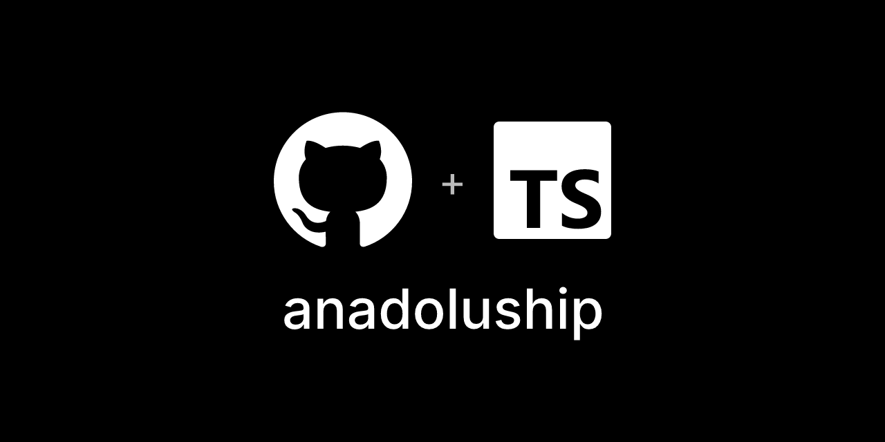

# @voxyfy/anadoluship — Node.js/TypeScript Kargo API Kütüphanesi

<p align="center">
  
</p>

**anadoluship**, Türkiye'deki kargo firmalarının (**MNG Kargo API**,
**Yurtiçi Kargo API**, **Aras Kargo API**, **PTT Kargo API**, **Sürat Kargo
API**) ve **UPS**'in gönderi oluşturma, kargo takip ve gönderi iptal
işlemlerini tek bir `ShippingProvider` arayüzü arkasında birleştiren,
framework'e bağımlı olmayan bir **Node.js / TypeScript kargo entegrasyon
SDK'sıdır**. Kargo takip API'si, sanal kargo entegrasyonu veya çok
sağlayıcılı bir shipping SDK arayan Node.js/TypeScript geliştiricileri için
tasarlandı.

> ⚠️ **Erken aşama.** `FakeProvider`'ın yanında altı gerçek driver var:
> **`MngProvider`**, **`UpsProvider`**, **`YurticiProvider`**,
> **`ArasProvider`**, **`PttProvider`**, **`SuratProvider`** — hepsi ilgili
> firmanın gerçek API şemasına (OpenAPI/Swagger veya SOAP WSDL) göre yazıldı
> ve mock'lanmış HTTP ile birim test kapsamında. **Hiçbiri gerçek bir hesapla
> ölçülmedi** — her firma kendi türünden bir engel çıkarıyor: MNG sayısal
> müşteri numarası, UPS ödeme yöntemi eklenmiş bir gönderici hesabı, diğer
> dördü ise kurumsal başvuru/sözleşme istiyor. Detaylar için
> [Kapsam ve doğrulama durumu](#kapsam-ve-doğrulama-durumu-kargo-firmaları),
> [MNG ile başlarken](#mng-ile-başlarken) ve
> [UPS ile ilgili durum](#ups-ile-ilgili-durum) bölümlerine bakın. `Aras` ve
> `Sürat` driver'larında `trackShipment`, `UPS` driver'ında `calculateRate`
> bilerek implement edilmedi — sebepleri ilgili bölümlerde açıklanıyor.

## Amacımız

[AnadoluPay](https://github.com/Voxyfy/anadolupay), Türk banka ve ödeme
sağlayıcılarını (NestPay, PayFor, PayFlex, iyzico, PayTR ve daha fazlası) tek
bir arayüzde toplayan, gerçek banka test ortamlarına karşı ölçülerek
doğrulanmış bir kütüphane ailesi (PHP + Node/TS portu). AnadoluShip, aynı
"çok sağlayıcı, tek API, driver mimarisi" yaklaşımını **kargo firmalarına**
taşıma girişimidir.

Neden bu işe değer bulduk:

- **Node/TS ekosisteminde bu paketin dengi yok.** Gördüğümüz kargo
  kütüphaneleri ya tek bir firmayı kapsıyor ya da web scraping tabanlı takip
  yapıyor. Çok sağlayıcılı, testli, gerçek API'ye dayanan bir paket bu
  ekosistemde henüz yok.
- **Mevcut açık kaynak girişimleri olgun değil.** İncelediğimiz en kapsamlı
  girişimde 12 firma × 6 fonksiyondan (create/track/cancel × yurt içi/yurt
  dışı) sadece 1'inin gerçekten çalıştığını, testlerin IDE tarafından
  üretilmiş boş iskeletler olduğunu ve projenin ~2 yıldır terk edildiğini
  gördük.
- **Sandbox/dokümantasyon durumu firmadan firmaya çok değişiyor.** MNG'nin
  self-servis geliştirici portalı (`sandbox.mngkargo.com.tr`, "Apizone" —
  şu anda DHL eCommerce markası altında yayınlanıyor) ve açık sandbox'ı var,
  kayıt olup API ürünlerine (Barcode Command, Bulk Query, CBS Info, Finance
  Query vb.) doğrudan erişilebiliyor; UPS'in global Developer Kit + CIE
  sandbox'ı var. Yurtiçi ve Aras'ın ayrı test host'ları var ama kimlik
  bilgisi almak kurumsal başvuruya bağlı. PTT belirsiz, Sürat'ta hiç sandbox
  yok. Bu yüzden driver'lar sırayla, doğrulanabilirlik kolaylığına göre
  yazılacak.

## Kurulum

```bash
npm install @voxyfy/anadoluship
```

```ts
import { createAnadoluShip, FakeProvider } from '@voxyfy/anadoluship';
```

Node.js 18 veya üzeri gerekir. Kütüphane framework'e bağımlı değildir; hangi
driver'ları hangi kimlik bilgileriyle kuracağınızı `createAnadoluShip({ drivers })`
çağrısında siz belirlersiniz.

## Mimari

| Kavram | Bu pakette |
|---|---|
| Driver sözleşmesi | `ShippingProvider` interface'i — `createShipment`, `trackShipment`, `cancelShipment` |
| Firma bazında değişen yetenekler | `contracts/capabilities.ts`'teki tip-koruyucu fonksiyonlar (`supportsLabelRetrieval`, `supportsRateQuote`) — etiket alma ve fiyat sorgusu her firmada yok |
| DTO'lar | `Address`, `Parcel`, `CreateShipmentData`, `ShipmentResponse`, `TrackingResponse`, `CancelShipmentResponse`, `LabelResponse`, `RateQuoteData/Response` — `dto/` altında |
| Durum normalizasyonu | `support/ShipmentStatus.ts` — firma yanıtları bu enum'a eşlenir |
| İstemci | `createAnadoluShip({ drivers })` — tipli bir fabrika, framework'e bağımlı değil |
| Hata hiyerarşisi | `errors/AnadoluShipError.ts` — `DriverNotFoundError`, `ShipmentFailedError`, `UnsupportedCapabilityError` |

İlk driver **`FakeProvider`** — ağ çağrısı yapmaz, gönderileri bellekte tutar.
Bilerek en başta seçildi: mimarinin (DTO'lar, contract, yetenek tespiti, hata
hiyerarşisi) doğru kurulduğunu kanıtlar ve gerçek bir kargo firması kimliği
gerektirmez.

```ts
import {
  createAnadoluShip,
  FakeProvider,
  CreateShipmentData,
  Address,
  Parcel,
} from '@voxyfy/anadoluship';

const anadoluship = createAnadoluShip({
  drivers: {
    fake: () => new FakeProvider(),
  },
});

const provider = anadoluship.driver('fake');

const shipment = await provider.createShipment(
  new CreateShipmentData(
    'order-123',
    new Address('Gönderen A.Ş.', '05000000000', 'İstanbul', 'Kadıköy', 'Örnek Mah. 1. Sk. No:1'),
    new Address('Alıcı Ali', '05000000001', 'Ankara', 'Çankaya', 'Örnek Mah. 2. Sk. No:2'),
    new Parcel(1500, 2),
  ),
);

console.log(shipment.trackingNumber);
```

Firma bazında değişen yetenekleri kullanmadan önce tip-koruyucu ile kontrol
edin — her firma etiket alma veya fiyat sorgusu sunmaz:

```ts
import { supportsRateQuote } from '@voxyfy/anadoluship';

if (supportsRateQuote(provider)) {
  const quote = await provider.calculateRate(rateQuoteData);
}
```

## Kapsam ve doğrulama durumu (kargo firmaları)

| Firma | Driver durumu | API tipi | Sandbox/test ortamı |
|---|---|---|---|
| MNG Kargo | **Yazıldı, doğrulanmadı** — `MngProvider` (create+cancel+track+rate) | REST/JSON, API key (`X-IBM-Client-Id/Secret`) + JWT bearer | Var — `sandbox.mngkargo.com.tr` ("Apizone", DHL eCommerce markalı), self-servis kayıt doğrulandı |
| UPS | **Yazıldı, doğrulanmadı** — `UpsProvider` (create+cancel+track) | REST/JSON, OAuth2 Client Credentials | Var (CIE, `wwwcie.ups.com`) ama gönderici hesap numarası almak ödeme yöntemi eklemeyi gerektiriyor — bkz. [UPS ile ilgili durum](#ups-ile-ilgili-durum) |
| Yurtiçi Kargo | **Yazıldı, doğrulanmadı** — `YurticiProvider` (create+cancel+track) | SOAP/WSDL (document/literal, `soapAction=''`) | Var — ayrı test host'u, kimlik (`wsUserName`/`wsPassword`) kurumsal başvuruya bağlı |
| Aras Kargo | **Yazıldı, doğrulanmadı** — `ArasProvider` (create+cancel; track implement edilmedi) | SOAP/ASMX (`tempuri.org`) | Var — ayrı test host'u, kimlik kurumsal başvuruya bağlı |
| PTT Kargo | **Yazıldı, doğrulanmadı** — `PttProvider` (create+cancel+track) | SOAP/WSDL (iki ayrı servis: kabul + hareket) | Belirsiz — ayrı bir sandbox bulunamadı, kimlik kurumsal sözleşme gerektiriyor |
| Sürat Kargo | **Yazıldı, doğrulanmadı** — `SuratProvider` (create+cancel; track implement edilmedi) | SOAP/ASMX (`tempuri.org`) | Yok — sandbox'ı yok, tüm çağrılar prod'a gider |

Yurtiçi/Aras/PTT/Sürat driver'ları, firmaların kimlik doğrulaması
gerektirmeden herkese açık indirilebilen gerçek WSDL dosyalarından
(SOAP servislerinin XML şeması) çıkarıldı — bir OpenAPI/Swagger dosyası
değil ama aynı doğrulanabilirlik seviyesinde bir kaynak. Aras ve Sürat'ta
`trackShipment` bilerek implement edilmedi: WSDL'deki tek takip
operasyonları yapısı tanımsız düz bir metin veya sütun adları belirsiz bir
ADO.NET tablosu döndürüyor — gerçek bir örnek yanıt görmeden alan adlarını
tahmin etmemeyi seçtik.

AnadoluPay'de öğrenilen en kalıcı ders burada da geçerli: bir driver'ın "doğru
yazılmış olması" ile "gerçekten o kargo firmasına karşı çalışması" ayrı
şeyler. Her driver, yazıldıktan sonra ilgili firmanın test ortamına (varsa)
karşı doğrulanacak; sandbox'ı olmayan firmalarda bu adım daha yavaş ve
firma işbirliğine bağımlı olacak.

## MNG ile neler yapılabiliyor

Apizone'da MNG'nin altında 12 farklı API ürünü yayında, hepsi kontrol edildi
(gerçek OpenAPI/Swagger şemaları çıkarıldı). Bunlardan dördü `anadoluship`'e
entegre edildi:

| API Ürünü | Ne işe yarar | Durum |
|---|---|---|
| **Identity** | Token/JWT üretimi (kimlik doğrulama katmanı) | ✅ `MngProvider` içinde kullanılıyor |
| **Barcode Command** | Sipariş oluşturma → gönderiye çevirme, iptal, barkod üretme | ✅ `createShipment`/`cancelShipment` yazıldı |
| **Standard Query** | Sipariş/gönderi bilgisi, durum, hareket sorgusu **ve** taşıma ücreti hesaplama | ✅ `trackShipment` (`GET /trackshipmentByShipmentId`) ve `calculateRate` (`POST /calculate`) yazıldı |
| **CBS Info** | Şehir/ilçe/mahalle coğrafi kod listesi | ✅ `calculateRate` içinde şehir/ilçe adını MNG'nin istediği koda çevirmek için kullanılıyor (`getcities`/`getdistricts`, önbellekli) |

Geri kalan sekiz ürün (Standard Command, Plus Command, Plus Query, Bulk
Query, Finance Query, International, Utility, Next Tahsilat Makbuzu/Mobil
Kurye API) kontrol edildi ama `ShippingProvider` sözleşmesinde karşılığı
olmadığı için entegre edilmedi — pazaryeri-özel akışlar, toplu sorgu, fatura,
gümrük/yurt dışı ve geliştirici-referans bilgisi gibi farklı kullanım
senaryolarına hizmet ediyorlar. İsterseniz bunları [Apizone'daki API Ürünleri
sayfasından](https://sandbox.mngkargo.com.tr/tr/product) inceleyebilirsiniz.

`calculateRate` kullanırken dikkat: `RateQuoteData`'da **`receiverDistrict`
zorunludur** (MNG'nin `/calculate` uç noktası şehir/ilçe kodu istiyor, sadece
şehir yetmiyor) — verilmezse `MngProvider` ağ çağrısı yapmadan açık bir hata
fırlatır.

**Önemli not — kimlik doğrulama iki katmanlı:** `X-IBM-Client-Id`/
`X-IBM-Client-Secret` sadece *uygulamanızı* (Apizone'daki API tüketicisini)
tanımlar; her API ürününe **ayrı ayrı abone olmanız gerekir** (Barcode
Command'a abone olmak Identity'ye otomatik erişim vermez — bunu MNG driver'ını
test ederken 401 alarak öğrendik). Ayrıca `/token` çağrısının çalışması için
gereken **MNG Müşteri Numarası + şifresi** bambaşka bir katman: bu, Apizone
portal hesabınızın kullanıcı adı/şifresi değil, MNG'nin size ayrıca verdiği
**sayısal** bir hesap numarasıdır (Identity API'nin swagger dokümanı bu alanı
hatalı şekilde `string` gösteriyor, backend `int64` bekliyor). Bunu self-servis
olarak portaldan almanın bir yolu yok; portaldaki yorumlarda birden fazla
geliştirici aynı soruyu sorup yanıt alamamış — MNG/DHL eCommerce ile
doğrudan iletişime geçmek gerekiyor.

## Yol haritası

1. `ShippingProvider` sözleşmesi + `FakeProvider` — ✅ tamam
2. MNG Kargo driver'ı — ✅ `createShipment`/`cancelShipment`/`trackShipment`/`calculateRate` yazıldı ve mock'lu testlerle doğrulandı, ⏳ gerçek sandbox'a karşı doğrulanacak (sayısal müşteri numarası bekleniyor) — bkz. [MNG ile neler yapılabiliyor](#mng-ile-neler-yapılabiliyor)
3. UPS driver'ı — ✅ `createShipment`/`trackShipment`/`cancelShipment` yazıldı ve mock'lu testlerle doğrulandı, ⏳ gerçek sandbox'a karşı doğrulanacak (gönderici hesap numarası bekleniyor) — bkz. [UPS ile ilgili durum](#ups-ile-ilgili-durum)
4. Yurtiçi Kargo driver'ı — ✅ `createShipment`/`trackShipment`/`cancelShipment` yazıldı ve mock'lu testlerle doğrulandı, ⏳ gerçek test hesabı bekleniyor (kurumsal başvuru)
5. Aras Kargo driver'ı — ✅ `createShipment`/`cancelShipment` yazıldı, `trackShipment` bilerek implement edilmedi (ADO.NET DiffGram yanıtı), ⏳ gerçek test hesabı bekleniyor
6. PTT Kargo driver'ı — ✅ `createShipment`/`trackShipment`/`cancelShipment` yazıldı, ⏳ gerçek kurumsal sözleşme bekleniyor
7. Sürat Kargo driver'ı — ✅ `createShipment`/`cancelShipment` yazıldı, `trackShipment` bilerek implement edilmedi (yapısı tanımsız string yanıt), ⏳ gerçek hesap bekleniyor (sandbox yok)

## MNG ile başlarken

MNG driver'ını gerçek sandbox'a karşı denemek (veya kendi entegrasyonunuzu
yazmak) için Apizone üzerinde şu adımları izleyin:

1. **Hesap oluşturun** — [sandbox.mngkargo.com.tr](https://sandbox.mngkargo.com.tr)
   adresinde ücretsiz kayıt olun (portal "Apizone" / DHL eCommerce markası
   altında).
2. **Uygulama oluşturun** — *Uygulamalar → Yeni uygulama oluştur*. Sadece
   **Başlık** zorunlu. **"Application OAuth Redirect URL(s)"** alanını boş
   bırakabilirsiniz — bu alan sadece tarayıcı tabanlı OAuth2 Authorization
   Code akışı için var; MNG API'leri sunucu-sunucu (API key + JWT) ile
   çalıştığı için bu projede kullanılmıyor.
3. **Kimlik bilgilerinizi alın** — oluşturduğunuz uygulamanın *Abonelikler*
   sekmesinde **API Anahtarı** (`X-IBM-Client-Id`) ve **API Güvenlik
   Dizgisi** (`X-IBM-Client-Secret`, göz simgesiyle görünür hale gelir) yer
   alır.
4. **İhtiyacınız olan her API ürününe ayrı ayrı abone olun** — *API Ürünleri →
   [Ürün adı] → Default Plan → Seç*, uygulamanızı seçip aboneliği onaylayın
   (hepsi ücretsiz, onay gerektirmiyor). `MngProvider` şu ürünleri kullanıyor,
   dördüne de abone olmanız gerekir: **Identity**, **Barcode Command**,
   **Standard Query**, **CBS Info**. Bir ürüne abone olmak diğerine otomatik
   erişim vermiyor — bunu `/token` çağrısında 401 alarak öğrendik
   ("Cannot find valid subscription for the incoming API request").
5. **Test müşteri numarası/şifresi edinin** — bu, uygulama kimliğinden
   ayrı bir katman: `MngProvider`'ın kullandığı `/mngapi/api/token`
   endpoint'i bir **MNG Müşteri Numarası + şifresi** ister. Bunu
   **self-servis olarak portaldan alamıyoruz** — Identity API ürününün
   yorumlarında birden fazla geliştirici aynı soruyu sormuş
   ("test müşteri numarası nasıl alınır?") ve yanıtlanmamış durumda; MNG/DHL
   eCommerce ile iletişime geçmek gerekebilir.
6. **`.env` dosyanızı doldurun** — bu depodaki `.env.example`'ı kopyalayıp
   `MNG_CLIENT_ID`, `MNG_CLIENT_SECRET`, `MNG_CUSTOMER_NUMBER`,
   `MNG_PASSWORD` değerlerini girin. Bu dosya `.gitignore`'da hariç
   tutulur — hiçbir zaman commit'lemeyin.
7. **Kod ile çağırın:**

   ```ts
   import { MngProvider, CreateShipmentData, RateQuoteData, Address, Parcel } from '@voxyfy/anadoluship';

   const provider = new MngProvider({
     clientId: process.env.MNG_CLIENT_ID!,
     clientSecret: process.env.MNG_CLIENT_SECRET!,
     customerNumber: process.env.MNG_CUSTOMER_NUMBER!,
     password: process.env.MNG_PASSWORD!,
     // baseUrl: 'https://testapi.mngkargo.com.tr' (varsayılan, sandbox)
   });

   const shipment = await provider.createShipment(
     new CreateShipmentData(
       'order-123',
       new Address('Gönderen A.Ş.', '05000000000', 'İstanbul', 'Kadıköy', 'Örnek Mah. 1. Sk. No:1'),
       new Address('Alıcı Ali', '05000000001', 'Ankara', 'Çankaya', 'Örnek Mah. 2. Sk. No:2'),
       new Parcel(1500, 2),
     ),
   );

   console.log(shipment.trackingNumber);

   // Takip
   const tracking = await provider.trackShipment(shipment.trackingNumber);
   console.log(tracking.status, tracking.events);

   // Ücret sorgusu — receiverDistrict zorunlu (MNG şehir/ilçe kodu ister)
   const quote = await provider.calculateRate(
     new RateQuoteData('İstanbul', 'Ankara', new Parcel(1500, 2), 'Çankaya'),
   );
   console.log(quote.amount, quote.currency);
   ```

8. **Testleri çalıştırın** — iki katman var:

   - **Birim testler** (`tests/MngProvider.test.ts`) — `fetch` mock'lanır,
     gerçek bir hesap gerektirmez, her zaman çalışır. Apizone'dan çıkardığımız
     gerçek istek/yanıt şemalarına göre `createShipment`/`trackShipment`/
     `cancelShipment`/`calculateRate`'in doğru URL, header ve body ürettiğini
     doğrular.
   - **Canlı test** (`tests/MngProvider.live.test.ts`) — yukarıdaki 4 ortam
     değişkeni tanımlıysa gerçek `testapi.mngkargo.com.tr` uç noktasına çağrı
     yapar; tanımlı değilse otomatik atlanır (CI'yı kırmaz):

     ```bash
     MNG_CLIENT_ID=... MNG_CLIENT_SECRET=... MNG_CUSTOMER_NUMBER=... MNG_PASSWORD=... npm test
     ```

   Müşteri numarası/şifresi henüz elinizde yoksa (adım 5), canlı test atlanmış
   olarak görünecektir — birim testler kodun şemaya *uyumlu* olduğunu
   kanıtlar, canlı test ise MNG'nin sandbox'ının bu isteği *gerçekte kabul
   ettiğini* kanıtlar. İkisi farklı şeyler doğrular, biri diğerinin yerini
   tutmaz.

## UPS ile neler yapılabiliyor

UPS'in API katalogunda 25'ten fazla ürün var (developer.ups.com/catalog).
Bunlardan dördü `anadoluship`'e entegre edildi:

| API Ürünü | Ne işe yarar | Durum |
|---|---|---|
| **Authorization (OAuth)** | Token üretimi — tüm entegrasyonlar için zorunlu | ✅ `UpsProvider` içinde kullanılıyor |
| **Shipping** | Gönderi oluşturma, iptal (void), etiket alma | ✅ `createShipment`/`cancelShipment` yazıldı — etiket create yanıtına gömülü geliyor, ayrı `getLabel()` gerekmiyor |
| **Tracking** | Gönderi durumu, hareket geçmişi | ✅ `trackShipment` yazıldı |
| **Rating** | Ücret/servis karşılaştırma | 🔍 Kontrol edildi, entegre edilmedi — posta kodu + ülke kodu istiyor, `RateQuoteData` bu alanları içermiyor |

Kalan ürünler (Address Validation, Time In Transit, Paperless Documents,
Pickup, Dangerous Goods, Quantum View, World Ease, Forwarding, Commerce
Guard, Customs Detail ve çoğu "Premium" işaretli ek hizmet) kontrol edildi
ama `ShippingProvider` sözleşmesinde karşılığı yok — çoğu gümrük/uluslararası
evrak, depo/lojistik entegrasyonu veya ek ücretli risk/doğrulama servisi.
İsterseniz [UPS API Catalog'dan](https://developer.ups.com/catalog?loc=en_US)
inceleyebilirsiniz.

## UPS ile ilgili durum

`UpsProvider` kodu yazıldı ve mock'lu testlerle doğrulandı, ama **gerçek
UPS sandbox'ına (CIE) karşı hiç ölçülmedi** — MNG'den farklı olarak buradaki
engel bir müşteri numarası istemekten ibaret değil:

1. developer.ups.com'da "Create Application" akışında **"I need API
   credentials because I want to integrate UPS technology into my
   business"** seçilir (Client Credentials / Direct Integration — entegrasyon
   sahibi aynı zamanda UPS gönderici ise kullanılan yol; kütüphanenin diğer
   tüm driver'larıyla aynı model).
2. Bu akış, kimlik bilgilerini bir **UPS gönderici hesap numarasına**
   ("Choose an account to associate with these credentials for billing
   purposes") bağlamanızı ister — sadece iki seçenek var: var olan bir hesabı
   eklemek veya yeni bir hesap açmak.
3. **Yeni bir UPS gönderici hesabı açmak bir ödeme yöntemi eklemeyi
   gerektiriyor** (UPS.com hesap panelinde "Default Shipping Account" altında
   "Add a Payment Method" çıkıyor). Bu, kart/ödeme bilgisi girmeyi gerektiren
   bir adım — bilerek atlandı, kimse adına bu bilgiyi girmiyoruz.

Yani `UpsProvider`, developer.ups.com'un kamuya açık referans
dokümantasyonuna (OAuth Client Credentials, Shipping, Tracking API sayfaları)
göre yazıldı ama MNG'nin indirilebilir OpenAPI zip'i gibi tek tek
doğrulanabilecek bir kaynağa dayanmıyor — özellikle Tracking API'nin yanıt
şeması UPS'in yıllardır stabil, kamuya açık dokümantasyonundan çıkarıldı,
indirilip programatik olarak ayrıştırılmadı. Gerçek bir hesapla test etmek
isteyen biri şu adımları kendisi tamamlamalı: UPS.com'da bir ödeme yöntemi
ekleyip gönderici hesabı açmak, developer.ups.com'da bu hesaba bağlı bir
uygulama oluşturmak, client id/secret'ı `UpsProvider`'a geçmek.

```ts
import { UpsProvider, CreateShipmentData, Address, Parcel } from '@voxyfy/anadoluship';

const provider = new UpsProvider({
  clientId: process.env.UPS_CLIENT_ID!,
  clientSecret: process.env.UPS_CLIENT_SECRET!,
  accountNumber: process.env.UPS_ACCOUNT_NUMBER!,
  // baseUrl: 'https://wwwcie.ups.com' (varsayılan, CIE sandbox)
});

const shipment = await provider.createShipment(
  new CreateShipmentData(
    'order-123',
    new Address('Gönderen A.Ş.', '05000000000', 'İstanbul', 'Kadıköy', 'Örnek Mah. 1. Sk. No:1'),
    new Address('Alıcı Ali', '05000000001', 'Ankara', 'Çankaya', 'Örnek Mah. 2. Sk. No:2'),
    new Parcel(1500, 2),
  ),
);

const tracking = await provider.trackShipment(shipment.trackingNumber);
console.log(tracking.status, tracking.events);
```

## Yurtiçi / Aras / PTT / Sürat ile ilgili durum

Bu dört driver, ilgili firmaların kimlik doğrulaması gerektirmeden herkese
açık indirilebilen gerçek WSDL dosyalarından yazıldı. MNG/UPS'teki gibi bir
geliştirici portalları olmadığı (veya bulunamadığı) için Apizone/developer.ups.com
tarzı adım adım bir "başlarken" rehberi yok — kimlik bilgisi doğrudan ilgili
firmanın satış/entegrasyon ekibinden kurumsal başvuru yoluyla alınıyor.

| Firma | Kullanılan SOAP operasyonları | Not |
|---|---|---|
| **Yurtiçi Kargo** | `createShipment`, `queryShipment`, `cancelShipment` | `queryShipment` yalnızca anlık durumu döner, hareket/olay listesi yok — `TrackingResponse.events` her zaman boş |
| **Aras Kargo** | `SetOrder`, `SetCanceledShipment` | `trackShipment` implement edilmedi — tek takip operasyonu (`GetCargoTransaction`) sütun adları WSDL'de tanımsız bir ADO.NET DiffGram döndürüyor |
| **PTT Kargo** | `kabulEkle2`, `barkodSorgu`, `barkodVeriSil` | İki farklı WSDL/servis kullanılıyor (kabul ve hareket) — `PttProviderConfig`'te `kabulBaseUrl`/`hareketBaseUrl` ayrı ayrı verilir |
| **Sürat Kargo** | `OrtakBarkodOlustur`, `GonderiGeriCek` | `trackShipment` implement edilmedi — tüm takip operasyonları yapısı tanımsız düz metin döndürüyor; ayrıca bu firmada sandbox yok, tüm çağrılar doğrudan prod'a gider |

Dördünde de `ShippingOrderVO`/`GonderiModel`/`InputDongu2` gibi istek
nesnelerinde WSDL'in zorunlu gösterdiği ama anlamı/geçerli değerleri
dokümante edilmemiş alanlar var (örn. Yurtiçi'nin `taxOfficeId`/
`dcCreditRule`, Sürat'ın `KargoTuru`/`OdemeTipi`). Bunlar driver
config'lerinde açık parametre olarak bırakıldı; gerçek değerleri kurumsal
sözleşmenizden/entegrasyon ekibinizden almanız gerekiyor.

## İlgili projeler

- **[Voxyfy/anadolupay](https://github.com/Voxyfy/anadolupay)** — aynı driver
  mimarisinin Türk banka/ödeme sağlayıcıları için PHP/Laravel karşılığı.
- **[Voxyfy/anadolupay-node](https://github.com/Voxyfy/anadolupay-node)** —
  aynı mimarinin Node.js/TypeScript'e taşınmış hali; bu paketin doğrudan
  esin kaynağı.

## Lisans

MIT
